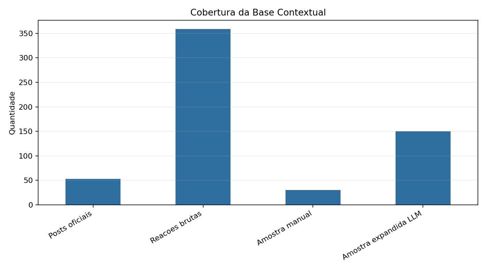
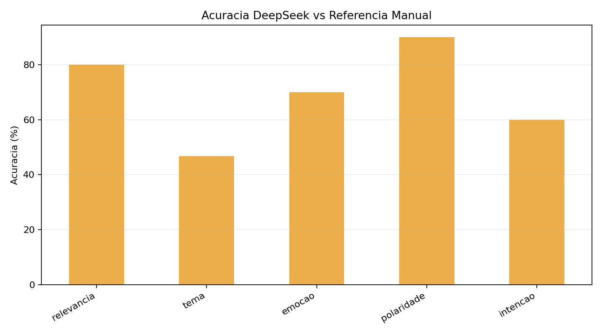
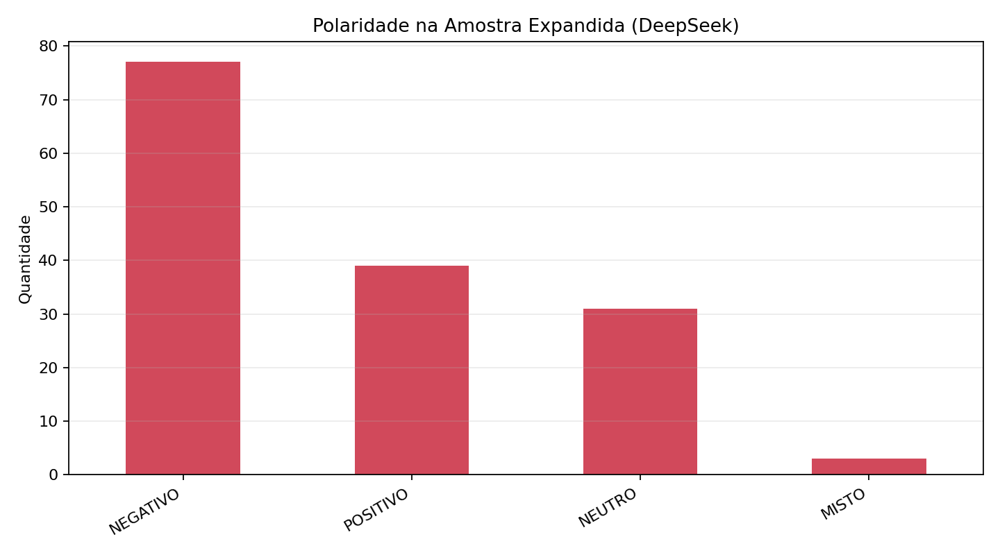
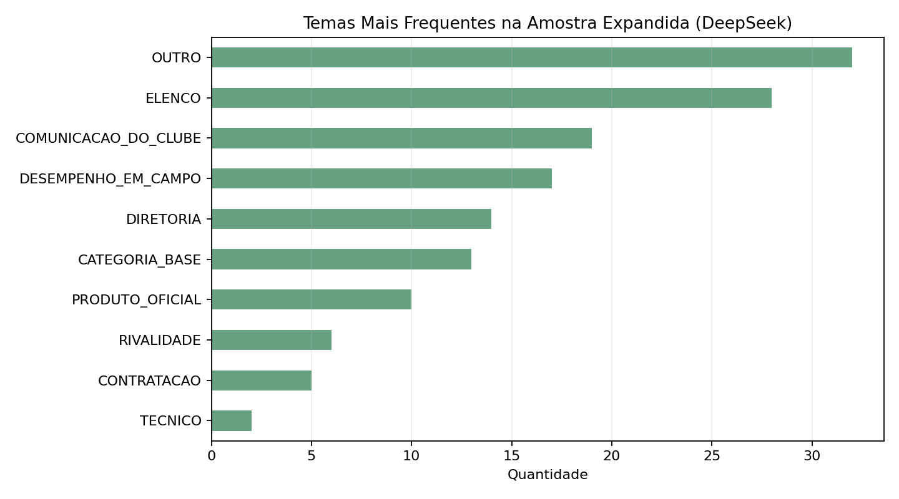
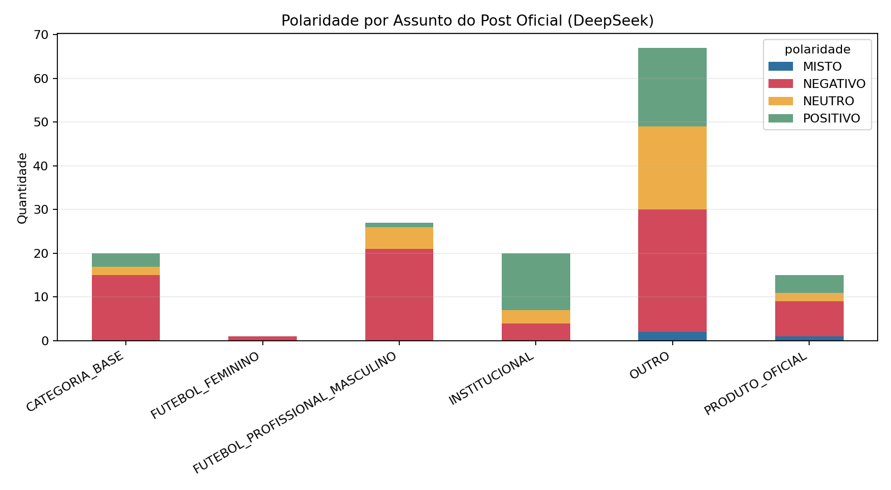

# Relatorio Final - PLN Queridometro de Torcidas

## Participantes

- Gabriel Lagares
- Hermes Winarski
- Vitor Andrade

## Resumo

Este trabalho apresenta uma PoC de Processamento de Linguagem Natural para analisar reacoes de torcedores a publicacoes oficiais de clubes de futebol. A versao final usa o Sao Paulo como clube piloto e adota uma pipeline contextual: publicacao oficial, replies e quote tweets associados, anotacao semantica e analise agregada.

Nao foi incluido baseline classico nesta versao. A avaliacao ficou concentrada na comparacao entre anotacao manual e anotacao automatica com DeepSeek.

## Problema e Objetivo

O problema investigado e como analisar, de forma contextualizada, as reacoes de torcedores a diferentes tipos de comunicacao oficial de um clube. O objetivo foi construir uma base contextual pequena, rastreavel e de baixo custo, capaz de sustentar analises sobre polaridade, tema, emocao e intencao comunicativa.

## Metodologia

A metodologia foi organizada em seis etapas:

1. Coleta de posts oficiais do `@SaoPauloFC` via endpoint `/2/tweets/search/recent`.
2. Coleta de replies e quote tweets associados aos posts oficiais.
3. Classificacao de tipo e assunto das publicacoes oficiais.
4. Anotacao manual inicial de 30 reacoes.
5. Anotacao automatica com DeepSeek.
6. Analise comparativa e exploratoria dos resultados.

## Base de Dados

- posts oficiais salvos: 53;
- reacoes brutas salvas: 359;
- reacoes com validacao manual inicial: 30;
- reacoes na amostra expandida anotada por LLM: 150.

## Custos Observados

- piloto inicial X/Twitter: US$ 0.30;
- expansao X/Twitter: US$ 0.0175;
- expansao DeepSeek: US$ 0.01.

Os custos reforcam a importancia de registrar cada chamada e salvar todos os registros retornados pela API.

## Taxonomia

A taxonomia final separa duas dimensoes do post oficial:

- `official_post_type`: formato comunicacional, como `RESULTADO`, `ESCALACAO`, `BASTIDORES` ou `PRODUTO_CAMISA`;
- `official_post_topic`: assunto/editoria, como `CATEGORIA_BASE`, `FUTEBOL_FEMININO`, `PRODUTO_OFICIAL` ou `FUTEBOL_PROFISSIONAL_MASCULINO`.

As reacoes foram classificadas por `relevancia`, `tema`, `emocao`, `polaridade` e `intencao`.

## Distribuicao dos Posts Oficiais

Tipos de publicacao oficial:

- `OUTRO`: 22
- `BASTIDORES`: 8
- `PRODUTO_CAMISA`: 7
- `PARTIDA`: 5
- `ESCALACAO`: 4
- `BASE`: 4
- `RESULTADO`: 3

Assuntos das publicacoes oficiais:

- `OUTRO`: 19
- `CATEGORIA_BASE`: 13
- `PRODUTO_OFICIAL`: 7
- `FUTEBOL_PROFISSIONAL_MASCULINO`: 6
- `INSTITUCIONAL`: 5
- `FUTEBOL_FEMININO`: 3

## Resultados da Amostra Manual

A amostra manual inicial apresentou forte predominancia negativa:

- `NEGATIVO`: 25
- `NEUTRO`: 3
- `MISTO`: 2

Essa concentracao indica que o periodo coletado capturou uma torcida bastante critica em relacao ao clube.

## Comparacao DeepSeek vs Manual

A rodada `taxonomy_v3` usou validacao local de taxonomia e retry quando o modelo retornava rotulos invalidos. O resultado foi:

- `relevancia`: 80.0%
- `tema`: 46.7%
- `emocao`: 70.0%
- `polaridade`: 90.0%
- `intencao`: 60.0%

A polaridade foi a dimensao mais estavel. O campo `tema` foi o mais dificil, pois exige decidir qual e o alvo principal da reacao quando ha sobreposicao entre elenco, desempenho, diretoria, base e comunicacao do clube.

## Analise Expandida com DeepSeek

A amostra expandida possui 150 reacoes, balanceadas entre replies e quotes:

- `QUOTE`: 75
- `REPLY`: 75

Distribuicao de polaridade na amostra expandida:

- `NEGATIVO`: 77
- `POSITIVO`: 39
- `NEUTRO`: 31
- `MISTO`: 3

Temas mais frequentes na amostra expandida:

- `OUTRO`: 32
- `ELENCO`: 28
- `COMUNICACAO_DO_CLUBE`: 19
- `DESEMPENHO_EM_CAMPO`: 17
- `DIRETORIA`: 14
- `CATEGORIA_BASE`: 13
- `PRODUTO_OFICIAL`: 10
- `RIVALIDADE`: 6
- `CONTRATACAO`: 5
- `TECNICO`: 2

A amostra expandida mostra predominancia de reacoes negativas, mas tambem inclui volume relevante de reacoes positivas e neutras. Isso ajuda a observar diferencas entre posts de produto, institucional, categoria de base e futebol profissional.

## Discussao

Os resultados indicam que a abordagem contextual melhora a qualidade analitica em relacao a buscas soltas por mencoes. Ao associar cada reacao ao post oficial que a originou, torna-se possivel comparar como a torcida reage a formatos e assuntos diferentes.

A DeepSeek apresentou bom desempenho para polaridade e relevancia, mas mostrou maior dificuldade no campo `tema`. Isso sugere que a taxonomia precisa de criterios de desempate mais explicitos quando a reacao mistura critica ao desempenho, cobranca de elenco, mencao a categorias de base e avaliacao da comunicacao do clube.

## Limitacoes

- o estudo usa apenas um clube piloto;
- a amostra manual validada ainda tem 30 reacoes;
- a amostra expandida foi rotulada automaticamente e ainda precisa de revisao humana;
- a coleta reflete uma janela recente especifica;
- nao houve treinamento ou comparacao com modelos classicos nesta versao.

## Conclusao

A PoC demonstra que e viavel construir uma pipeline contextual de baixo custo para analisar reacoes de torcedores. O projeto ja possui coleta rastreavel, taxonomia, anotacao manual inicial, anotacao LLM, analise de divergencias e graficos exploratorios. Para uma proxima etapa, a prioridade deve ser ampliar a validacao manual da amostra expandida e refinar os criterios do campo `tema`.
